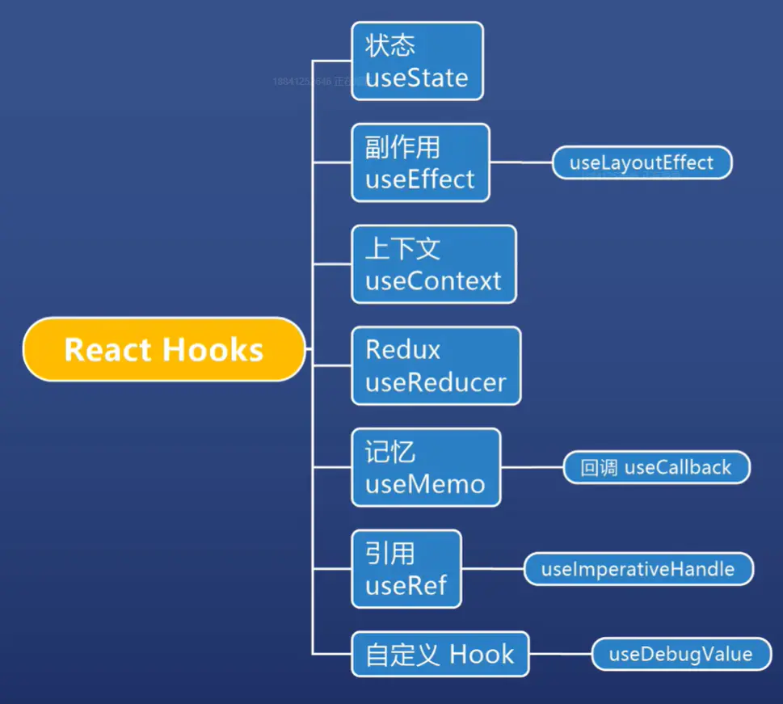

# React Hooks

### 1. hooks总览



###### 什么是react 的 hook 以及 react hooks 的由来

官网解释：*Hook* 是 React 16.8 的新增特性。它可以让你在不编写 class 的情况下使用 state 以及其他的 React 特性。Hook 本质就是 JavaScript 函数，但是在使用它时需要遵循两条规则。我们提供了一个 [linter 插件](https://links.jianshu.com/go?to=https%3A%2F%2Fwww.npmjs.com%2Fpackage%2Feslint-plugin-react-hooks)来强制执行这些规则：

<!--more-->

说白了就是对于函数组件的加强，增加了对于函数组件的一些特性，像class组件那样使用

### 2.useState 使用状态

```js
const [n,setN] = React.useState(0)
const [user,setUser] = React.useState({name:'F'})
```

注意事项1：不可局部更新

- 如果state是一个对象，不可以局部setState
- 因为 setState 不会帮我们合并属性
- useReducer 也不会合并

注意事项2：地址要变

- setState(obi)如果obj地址不变，那么 React 就认为数据没有变化

useState 可以接受函数

```js
const [state,setState] = useState(()=>{
    return initialState
})
```

该函数返回初始state，且只执行一次，相比于传入对象可以减少计算过程

###### setState 接受函数

```js
function App() {   // App函数组件
    const [n, setN] = useState(0)
    const onClick = () => {
        setN(n + 1);
        setN(n + 1);
    }
    return (
        <div className='App'>
            <h1>n:{n}</h1>
            <button onClick={onClick}>n+1</button>
        </div>
    )
}
```

当我点击按钮，只会加一，而不会加二

```js
function App() {   // App函数组件
    const [n, setN] = useState(0)
    const onClick = () => {
        setN(x => x + 1);      // 改成函数写法
        setN(n => n + 1);
    }
    return (
        <div className='App'>
            <h1>n:{n}</h1>
            <button onClick={onClick}>n+1</button>
        </div>
    )
}
```

函数写法最后会执行加2操作，因此要尽可能使用函数的写法

### 3. useReducer

使用步骤：

1. 创建初始值 initialState
2. 创建所有操作reducer(state,action)
3. 传给useReducer，得到读和写API
4. 调用写 ({type:'操作类型'})

总得来说<u>useReducer是useState的复杂版</u>

示例代码：

```js
const initial = {
    n: 0
}
const reducer = (state, action) => {
    if (action.type === 'add') {
        return {n: state.n + action.number}
    } else if (action.type === 'multi') {
        return {n: state.n * 2}
    } else {
        throw new Error('unknown type')
    }
}

function App() {
    const [state, dispatch] = useReducer(reducer, initial)
    const {n} = state
    const onClick = () => {
        dispatch({
            type: 'add', number: 1
        })
    }
    const onClick2 = () => {
        dispatch({
            type: 'add', number: 2
        })
    }
    return (
        <div className='App'>
            <h1>n:{n}</h1>
            <button onClick={onClick}>+1</button>
            <button onClick={onClick2}>+2</button>
        </div>
    )
}
```

简单点说就是把操作汇总在一起了

###### 一个适合使用 useReducer 的场景：

```jsx
import React, { useReducer } from "react";
import ReactDOM from "react-dom";

const initFormData = {
  name: "",
  age: 18,
  nationality: "汉族"
};

function reducer(state, action) {
  switch (action.type) {
    case "patch":
      return { ...state, ...action.formData };
    case "reset":
      return initFormData;
    default:
      throw new Error();
  }
}

function App() {
  const [formData, dispatch] = useReducer(reducer, initFormData);
  // const patch = (key, value)=>{
  //   dispatch({ type: "patch", formData: { [key]: value } })
  // }
  const onSubmit = () => {};
  const onReset = () => {
    dispatch({ type: "reset" });
  };
  return (
    <form onSubmit={onSubmit} onReset={onReset}>
      <div>
        <label>
          姓名
          <input
            value={formData.name}
            onInput={(e) =>
              dispatch({ type: "patch", formData: { name: e.target.value } })
            }
          />
        </label>
      </div>
      <div>
        <label>
          年龄
          <input
            value={formData.age}
            onChange={(e) =>
              dispatch({ type: "patch", formData: { age: e.target.value } })
            }
          />
        </label>
      </div>
      <div>
        <label>
          民族
          <input
            value={formData.nationality}
            onChange={(e) =>
              dispatch({
                type: "patch",
                formData: { nationality: e.target.value }
              })
            }
          />
        </label>
      </div>
      <div>
        <button type="submit">提交</button>
        <button type="reset">重置</button>
      </div>
      <hr />
      {JSON.stringify(formData)}
    </form>
  );
}

const rootElement = document.getElementById("root");
ReactDOM.render(<App />, rootElement);
```

#### 如何使用 useReducer 代替 Redux

步骤：

1. 将数据集中在一个store对象
2. 将所有操作集中在reducer
3. 创建一个Context
4. 创建对数据的读写API
5. 将第四步的内容放到第三步的Context
6. 用Context.Provider将Context提供给所有组件
7. 各个组件用useContext 获取读写API

示例代码：

```jsx
import React, { useReducer, useContext, useEffect } from "react";
import ReactDOM from "react-dom";

const store = {
  user: null,
  books: null,
  movies: null
};

function reducer(state, action) {
  switch (action.type) {
    case "setUser":
      return { ...state, user: action.user };
    case "setBooks":
      return { ...state, books: action.books };
    case "setMovies":
      return { ...state, movies: action.movies };
    default:
      throw new Error();
  }
}

const Context = React.createContext(null);

function App() {
  const [state, dispatch] = useReducer(reducer, store);

  const api = { state, dispatch };
  return (
      <Context.Provider value={api}>
        <User />
        <hr />
        <Books />
        <Movies />
      </Context.Provider>
  );
}

function User() {
  const { state, dispatch } = useContext(Context);
  useEffect(() => {
    ajax("/user").then(user => {
      dispatch({ type: "setUser", user: user });
    });
  }, []);
  return (
      <div>
        <h1>个人信息</h1>
        <div>name: {state.user ? state.user.name : ""}</div>
      </div>
  );
}

function Books() {
  const { state, dispatch } = useContext(Context);
  useEffect(() => {
    ajax("/books").then(books => {
      dispatch({ type: "setBooks", books: books });
    });
  }, []);
  return (
      <div>
        <h1>我的书籍</h1>
        <ol>
          {state.books ? state.books.map(book => <li key={book.id}>{book.name}</li>) : "加载中"}
        </ol>
      </div>
  );
} 

function Movies() {
  const { state, dispatch } = useContext(Context);
  useEffect(() => {
    ajax("/movies").then(movies => {
      dispatch({ type: "setMovies", movies: movies });
    });
  }, []);
  return (
      <div>
        <h1>我的电影</h1>
        <ol>
          {state.movies
              ? state.movies.map(movie => <li key={movie.id}>{movie.name}</li>)
              : "加载中"}
        </ol>
      </div>
  );
}

// 假 ajax
// 两秒钟后，根据 path 返回一个对象，必定成功不会失败
function ajax(path) {
  return new Promise((resolve, reject) => {
    setTimeout(() => {
      if (path === "/user") {
        resolve({
          id: 1,
          name: "Frank"
        });
      } else if (path === "/books") {
        resolve([
          {
            id: 1,
            name: "JavaScript 高级程序设计"
          },
          {
            id: 2,
            name: "JavaScript 精粹"
          }
        ]);
      } else if (path === "/movies") {
        resolve([
          {
            id: 1,
            name: "爱在黎明破晓前"
          },
          {
            id: 2,
            name: "恋恋笔记本"
          }
        ]);
      }
    }, 2000);
  });
}
export default App
```

### 4. useContext

- 全局变量是全局的上下文
- 上下文是局部的全局变量

###### 使用方法：

1. 使用 C = createContext( initial ) 创建上下文
2. 使用 < C.provider >圈定作用域
3. 在作用域内使用 useContext ( C ) 来使用上下文

示例代码：

```jsx
const Context = React.createContext(null);

function App() {
  const [state, dispatch] = useReducer(reducer, store);

  const api = { state, dispatch };
  return (
      <Context.Provider value={api}>
        <User />
        <hr />
        <Books />
        <Movies />
      </Context.Provider>
  );
}

function User() {
  const { state, dispatch } = useContext(Context);
  useEffect(() => {
    ajax("/user").then(user => {
      dispatch({ type: "setUser", user: user });
    });
  }, []);
  return (
      <div>
        <h1>个人信息</h1>
        <div>name: {state.user ? state.user.name : ""}</div>
      </div>
  );
}
```

### 5. useEffect

effect 是副作用的意思，实际上叫做 afterRender 更好一些 ，每次render 后运行，模仿生命周期函数

用途：

1. 作为componentDidMount使用，[ ] (空数组)作第二个参数


```jsx
function App() {
    const [n, setN] = useState(0)
    const onClick = function () {
        setN(i => i + 1)
    }

    const afterRender = useEffect
    afterRender(() => {
        console.log('第一次渲染执行这几句话')
    }, [])    // 第一次渲染执行

    return (
        <div>
            n:{n}
            <button onClick={onClick}>+1</button>
        </div>
    )
}
```

1. 作为componentDidUpdate使用，可指定依赖


```jsx
function App() {
    const [n, setN] = useState(0)
    const onClick = function () {
        setN(i => i + 1)
    }

    const afterRender = useEffect
    afterRender(() => {
        console.log('n变化时执行这句话')  
    }, [n])    // n变化时执行这句话
    
    const afterRender = useEffect
    afterRender(() => {
        console.log('任何 state 变化时执行这句话')  
    })    // 任何 state 变化时 执行这句话

    return (
        <div>
            n:{n}
            <button onClick={onClick}>+1</button>
        </div>
    )
}
```

1. 作为componentWillUnmount使用，通过 return


```jsx
function App() {
    const [n, setN] = useState(0)
    const onClick = function () {
        setN(i => i + 1)
    }

    useEffect(() => {
        const id = setInterval(() => {
            console.log('hi')
        }, 1000)
        return () => {
            window.clearInterval(id)
        }
    }, [])

    return (
        <div>
            n:{n}
            <button onClick={onClick}>+1</button>
        </div>
    )
}
```

###### 以上三种用途可同时存在

特点：

- 如果同时存在多个useEffect，会按照出现次序执行

#### useLayoutEffect

###### 布局副作用：

- useEffect在浏览器渲染完成后执行

- useLayoutEffect 在浏览器渲染前执行

###### 特点：

- useLayoutEffect总是比useEffect先执行
- useLayoutEffect 里的任务最好影响了Layout

###### 经验：

- 为了用户体验，优先使用useEffect (优先渲染)

### 6. useMemo

首先认识一下 React.memo

- React 默认有多余的 render

```jsx
function App() {
  const [n, setN] = React.useState(0);
  const [m, setM] = React.useState(0);
  const onClick = () => {
    setN(n + 1);
  };

  return (
    <div className="App">
      <div>
        <button onClick={onClick}>update n {n}</button>
      </div>
      <Child data={m}/>
      {/* <Child2 data={m}/> */}
    </div>
  );
}

function Child(props) {
  console.log("child 执行了");
  console.log('假设这里有大量代码')
  return <div>child: {props.data}</div>;
}   
```

以上代码运行时，点击按钮会打印 20 21 行的log，这假设 Child 组件里面有大量的逻辑代码，会浪费性能

改进：


```jsx
function App() {
  const [n, setN] = React.useState(0);
  const [m, setM] = React.useState(0);
  const onClick = () => {
    setN(n + 1);
  };

  return (
    <div className="App">
      <div>
        <button onClick={onClick}>update n {n}</button>
      </div>
      <Child2 data={m}/>
    </div>
  );
}

function Child(props) {
  console.log("child 执行了");
  console.log('假设这里有大量代码')
  return <div>child: {props.data}</div>;
}

const Child2 = React.memo(Child);    // 这样在不改变 Child 组件内部数据的情况下就不会执行函数

// 还可以直接写成
const Child2 = React.memo(props=>{
  console.log("child 执行了");
  console.log('假设这里有大量代码')
  return <div>child: {props.data}</div>;
})
```

但是这样会有问题：当我们在 App 组件内部传给 child 组件一个事件监听函数的时候 ，当App的内部值变化时，child 组件函数还是会执行，因为 App 函数执行的同时，会产生新的函数，相当于函数对象换了地址，就会导致 child 组件函数的执行，解决方法就是使用 useMomo

### useMemo：

缓存一些不希望重新生成的 value value可以是任何数据类型

特点：

- 第一个参数是 () => { }
- 第二个参数是依赖[ m,n ]
- 只有当依赖变化时,才会计算出新的 value
- 如果依赖不变，那么就重用之前的value
- 是不是跟 vue 2 的 computed 很相似

注意：

- 如果你的value是个函数,那么你就要写成 useMemo ( ( )=> (×) => console.log(×) )
- 这是一个返回函数的函数
- 这很难用，于是 useCallback 出现了

##### useCallback:

用法：

- useCallback( x => log(x),[ m ] ) 等价于
- useMemo ( ( )=> x => log( x ) ,[ m ])
- 实际上就是缓存函数时的一个语法糖

使用 useMemo 解决上述的 React.memo 的函数复用的问题，示例代码：


```jsx
function App() {
  const [n, setN] = React.useState(0);
  const [m, setM] = React.useState(0);
  const onClick = () => {
    setN(n + 1);
  };
  const onClick2 = () => {
    setM(m + 1);
  };
  const onClickChild = useMemo(() => {
    const fn = div => {
      console.log("on click child, m: " + m);
      console.log(div);
    };
    return fn;
  }, [m]); // 这里呃 [m] 改成 [n] 就会打印出旧的 m
  return (
    <div className="App">
      <div>
        <button onClick={onClick}>update n {n}</button>
        <button onClick={onClick2}>update m {m}</button>
      </div>
      <Child2 data={m} onClick={onClickChild} />
    </div>
  );
}

function Child(props) {
  console.log("child 执行了");
  console.log("假设这里有大量代码");
  return <div onClick={e => props.onClick(e.target)}>child: {props.data}</div>;
}

const Child2 = React.memo(Child);
```

### 7. useRef

目的：

- 如果你需要一个值，在组件不断 render 时保持不变
- 初始化:const count = useRef ( 0 )
- 读取 : count.current
- 为什么要 current ? 为了保证两次的 useRef 是同一个值(只有引用能做到)

###### 能否做到变化时自动 render ？

- 不能
- 为什么不能 ？ 因为这不符合React的理念
- React 的理念是 UI= f(data)
- 你如果想要这个功能，完全可以自己加
- 监听 ref ,当ref.current 变化时，调用 setX 即可

#### forwardRef

由于 useRef 可以用来引用 DOM 对象，也可以用来引用普通对象，由于 props 不包括 ref，所以需要使用 forwardRed

使用示例：


```jsx
function App() {
  const buttonRef = useRef(null);
  return (
    <div className="App">
      <Button3 ref={buttonRef}>按钮</Button3>
    </div>
  );
}

const Button3 = React.forwardRef((props, ref) => {   // 这样才可以传递 ref DOM 引用
  return <button className="red" ref={ref} {...props} />;
});
```

#### useImperativeHandle

实际上应该叫做 setRef，他的作用就是设置当前 Ref 为另一个东西


```jsx
function App() {
  const buttonRef = useRef(null);
  useEffect(() => {
    console.log(buttonRef.current);
  });
  return (
    <div className="App">
      <Button2 ref={buttonRef}>按钮</Button2>
      <button
        className="close"
        onClick={() => {
          console.log(buttonRef);
          buttonRef.current.x();
        }}
      >
        x
      </button>
    </div>
  );
}

const Button2 = React.forwardRef((props, ref) => {
  const realButton = createRef(null);
  const setRef = useImperativeHandle;    // 函数本身
  setRef(ref, () => {
    return {     // 把真正的 ref 变身了
      x: () => {
        realButton.current.remove();
      },
      realButton: realButton
    };
  });
  return <button ref={realButton} {...props} />;
});
```

### 8. 自定义 hook

主要用于封装数据操作

示例代码：


```jsx
const useList = () => {    // 自定义的hook
  const [list, setList] = useState(null);
  useEffect(() => {
    ajax("/list").then(list => {
      setList(list);
    });
  }, []); // [] 确保只在第一次运行
  return {
    list: list,
    setList: setList
  };
};
export default useList;

function ajax() {    // 假的 ajax
  return new Promise((resolve, reject) => {
    setTimeout(() => {
      resolve([
        { id: 1, name: "Frank" },
        { id: 2, name: "Jack" },
        { id: 3, name: "Alice" },
        { id: 4, name: "Bob" }
      ]);
    }, 2000);
  });
}

function App() {  
  const { list, setList } = useList();   // 组件中直接使用 非常方便灵活
  return (
    <div className="App">
      <h1>List</h1>
      {list ? (
        <ol>
          {list.map(item => (
            <li key={item.id}>{item.name}</li>
          ))}
        </ol>
      ) : (
        "加载中..."
      )}
    </div>
  );
}
```

### 9. stale closures 过时闭包

实际上描述了我们在使用 hook 函数的时候 函数中使用的 旧的引用值的问题

看例子：


```js
function createIncrement(incBy) {
  let value = 0;

  function increment() {
    value += incBy;
    console.log(value);
  }

  const message = `Current value is ${value}`;
  function log() {
    console.log(message);
  }
  
  return [increment, log];
}

const [increment, log] = createIncrement(1);
increment(); // logs 1
increment(); // logs 2
increment(); // logs 3
// Does not work!
log();       // logs "Current value is 0"  旧的引用
```

上面代码在调用 log() 时只会打印 旧的值，因为 log 函数保存了 产生这个函数时的 value的值，闭包原理

改进：


```js
function createIncrement(incBy) {
  let value = 0;

  function increment() {
    value += incBy;
    console.log(value);
  }

  function log() {
    const message = `Current value is ${value}`;    // 直接使用 value
    console.log(message);
  }
  
  return [increment, log];
}

const [increment, log] = createIncrement(1);
increment(); // logs 1
increment(); // logs 2
increment(); // logs 3
// Works!
log();       // logs "Current value is 3"
```

###### React 中的体现   ———— useEffect()


```jsx
function WatchCount() {
  const [count, setCount] = useState(0);

  useEffect(function() {
    setInterval(function log() {
      console.log(`Count is: ${count}`);
    }, 2000);
  }, []);    // 只会打印 0 

  return (
    <div>
      {count}
      <button onClick={() => setCount(count + 1) }>
        Increase
      </button>
    </div>
  );
}
```

使用依赖改进


```jsx
function WatchCount() {
  const [count, setCount] = useState(0);

  useEffect(function() {
    const id = setInterval(function log() {
      console.log(`Count is: ${count}`);
    }, 2000);
    return function() {
      clearInterval(id);    // 必须清除定时器
    }
  }, [count]);  // 依赖改进

  return (
    <div>
      {count}
      <button onClick={() => setCount(count + 1) }>
        Increase
      </button>
    </div>
  );
}
```

###### React 中的体现   ———— useState()


```jsx
function DelayedCount() {
  const [count, setCount] = useState(0);

  function handleClickAsync() {
    setTimeout(function delay() {
      setCount(count + 1);
    }, 1000);
  }

  return (
    <div>
      {count}
      <button onClick={handleClickAsync}>Increase async</button>
    </div>
  );
}
```

每次点击时，`setTimeout(delay, 1000)`计划`delay()`在1秒后执行。`delay()`将变量捕获`count`为`0`。

两个`delay()`闭包（因为已经进行了 2 次点击）都将状态更新为相同的值：`setCount(count + 1) = setCount(0 + 1) = setCount(1)`。

全部是因为`delay()`第二次点击的关闭已捕获了过时的`count`变量as `0`。

改进：

```jsx
function DelayedCount() {
  const [count, setCount] = useState(0);

  function handleClickAsync() {
    setTimeout(function delay() {
      setCount(count => count + 1);
    }, 1000);
  }

  function handleClickSync() {
    setCount(count + 1);
  }

  return (
    <div>
      {count}
      <button onClick={handleClickAsync}>Increase async</button>
      <button onClick={handleClickSync}>Increase sync</button>
    </div>
  );
}   // 单击快速增加异步2次。在counter显示正确的值2。
```

解决陈旧闭包的有效方法是正确设置 React 钩子的依赖项。或者，在状态陈旧的情况下，使用函数方式来更新状态。