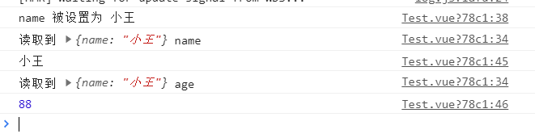

### vue3.0通过Proxy实现数据的双向绑定

> proxy是什么？
>
> Proxy是 ES6 中新增的一个特性，翻译过来意思是"代理"，用在这里表示由它来“代理”某些操作。 Proxy 让我们能够以简洁易懂的方式控制外部对对象的访问。其功能非常类似于设计模式中的代理模式。
>
> Proxy 可以理解成，在目标对象之前架设一层“拦截”，外界对该对象的访问，都必须先通过这层拦截，因此提供了一种机制，可以对外界的访问进行过滤和改写。
>
> 使用 Proxy 的核心优点是可以交由它来处理一些非核心逻辑（如：读取或设置对象的某些属性前记录日志；设置对象的某些属性值前，需要验证；某些属性的访问控制等）。 从而可以让对象只需关注于核心逻辑，达到关注点分离，降低对象复杂度等目的。基本

基本用法

```javascript
let p = new Proxy(target, handler);
```

举例

```javascript
let obj = {};
let handler = {
    get(target, property) {
        console.log("读取到", target, property);
        return property in target ? target[property] : 88;
    },
    set(target, property, value) {
        console.log(`${property} 被设置为 ${value}`);
        target[property] = value;
        return true;  // 不加上这句代码会报错，必须要返回是否复制成功
    }
}
let p = new	Proxy(obj, handler);
p.name = '小王';
console.log(p.name);
console.log(p.age);
```



写一个Proxy实现输入框双向绑定显示的例子

```HTML
<input type="text" id="input">
<div>您输入的是：<span id="title"></span></div>
```

```javascript
const obj = {};
const input = document.getElementById("input");
const title = document.getElementById("title");
const newObj = new Proxy(obj, {
    get(target, key, receiver) {
        console.log("getting", key);
        return Reflect.get(target, key, receiver);
    },
    set(target, key, value, receiver) {
        console.log(target, key, value, receiver);
        if(key == 'text') {
            input.value = value
            title.innerHTML = value;
        }
        return Reflect.set(target, key, value, receiver);
    }
})
input.addEventListener("keyup", e => {
    newObj.text = e.target.value;
})
```


参考文档  https://juejin.im/post/5bf3e632e51d452baa5f7375