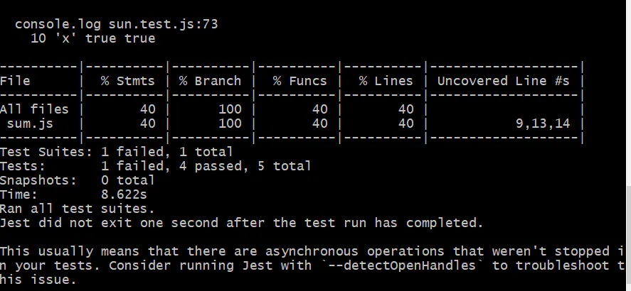

##### 1. 介绍

Jest是 Facebook 的一套开源的 JavaScript 测试框架， 它自动集成了断言、JSDom、覆盖率报告等开发者所需要的所有测试工具，是一款几乎零配置的测试框架。

##### 2. 安装

- 通过 npm 添加依赖：

```shell
 npm install --save-dev jest babel-jest babel-core babel-preset-env regenerator-runtime
```

babel-jest、 babel-core、 regenerator-runtime、babel-preset-env这几个依赖是为了让我们可以使用ES6的语法特性进行单元测试，ES6提供的 import 来导入模块的方式，Jest本身W是不支持的。

- 添加.babelrc文件

 在项目的根目录下添加.babelrc文件，并在文件复制如下内容:

```json
{
  "presets": ["env"]
}
```

- 修改package.json中的test脚本

打开package.json文件，将script下的test的值修改为jest：

```bash
"scripts": {
  "test": "jest"
}
```

如果在typescript中使用需要安装ts-jest

```shell
npm install ts-jest --save-dev
```

在项目根目录新建 `jest.config.js` 文件，如下：

```js
module.exports = {
    roots: [
        "<rootDir>/test"
    ],
    testRegex: 'test/(.+)\\.test\\.(jsx?|tsx?)$',
    transform: {
        "^.+\\.tsx?$": "ts-jest"
    },
    moduleFileExtensions: ['ts', 'tsx', 'js', 'jsx', 'json', 'node'],
};
```

##### 3. 使用

- sum.js

```jsx
import axios from 'axios';

function sum (a, b) {
  return a+b;
}
function add (a, b) {
  return a+b;
}
function fetchUser() {
  return axios.get('http://jsonplaceholder.typicode.com/users/1')
    .then(res => res.data)
    .catch(error => console.log(error));
}
export {
	sum,
  fetchUser
}
```

- sun.test.js

```tsx
import {sum , fetchUser}  from './sum';
// const fetchUser = require('./sum')

// 1. 相等判断：toBe 使用 Object.is 来判断相等，
// toEqual 会递归判断 Object 的每一个字段，
// 对数值来说 toBe 和 toEqual 相同；
test("两个数字相加", () => {
  expect(sum(1,2)).not.toBe(2);
})

test('object assignment', () => {
  const data = {one: 1};
  data['two'] = 2;
  expect(data).toEqual({one: 1, two: 2});
});

// 2. 判断符点数：可使用 toBeCloseTo 来解决 JS 浮点精度带来的问题，如下示例；
test('adding floating point numbers', () => {
  const value = 0.1 + 0.2; // 0.30000000000000004
  expect(value).toBeCloseTo(0.3); // 测试通过
});

test('fetchUser() 可以请求到一个含有name属性值为Leanne Graham的对象', () => {
  expect.assertions(1);
  return fetchUser()
    .then(data => {
      expect(data.name).toBe('Leanne Graham');
    });
});
//上面调用了expect.assertions(1)，它能确保在异步的测试用例中，
//有一个断言会在回调函数中被执行。这在进行异步代码的测试中十分有效。

test('mock', () => {
  const mockCallback = jest.fn(x => 42 + x);
  [0, 1].forEach(mockCallback);
  console.log(mockCallback.mock.calls,'mockCallback.mock.calls')
  // Mock函数被调用两次
  expect(mockCallback.mock.calls.length).toBe(2);
  // 第一次调用Mock函数时，第一个参数为0
  expect(mockCallback.mock.calls[0][0]).toBe(0);
  // 第二次调用Mock函数时，第一个参数为1
  expect(mockCallback.mock.calls[1][0]).toBe(1);
  // 第一次调用Mock函数的返回值为42
  expect(mockCallback.mock.results[0].value).toBe(42);

  // const myMock = jest.fn();
  // const a = new myMock();
  // const b = {};
  // const bound = myMock.bind(b);
  // bound();
  // console.log(myMock.mock.instances);
  // // > [ <a>, <b> ]

  // Mock 函数还可以通过工具函数模拟返回值。
  const myMock = jest.fn();
  console.log(myMock());
  // > undefined
  myMock
  .mockReturnValueOnce(10)
  .mockReturnValueOnce('x')
  .mockReturnValue(true);
  console.log(myMock(), myMock(), myMock(), myMock());
  // > 10, 'x', true, true
});
```

##### 4. 常用断点

```kotlin
expect({a:1}).toBe({a:1})//判断两个对象是否相等
expect({a:1}).toEqual({a:1})//归检查对象或数组的每个字段是否相等
expect(1).not.toBe(2)//判断不等
expect(n).toBeNull(); //判断是否为null
expect(n).toBeUndefined(); //判断是否为undefined
expect(n).toBeDefined(); //判断结果与toBeUndefined相反
expect(n).toBeTruthy(); //判断结果为true
expect(n).toBeFalsy(); //判断结果为false
expect(value).toBeGreaterThan(3); //大于3
expect(value).toBeGreaterThanOrEqual(3.5); //大于等于3.5
expect(value).toBeLessThan(5); //小于5
expect(value).toBeLessThanOrEqual(4.5); //小于等于4.5
expect(value).toBeCloseTo(0.3); // 浮点数判断相等
expect('Christoph').toMatch(/stop/); //正则表达式判断
expect(['one','two']).toContain('one'); //不解释

function compileAndroidCode() {
  throw new ConfigError('you are using the wrong JDK');
}

test('compiling android goes as expected', () => {
  expect(compileAndroidCode).toThrow();
  expect(compileAndroidCode).toThrow(ConfigError); //判断抛出异常
}）
```

[了解更多断点](https://links.jianshu.com/go?to=https%3A%2F%2Fjestjs.io%2Fdocs%2Fen%2Fexpect.html)

##### 5. 运行测试

- 运行测试
   `npm test`

- 使用 --watch 参数可以启动一个监控界面，当文件发生变化时，会便会运行相关的测试。
   `npm test --watch`

- 使用 --coverage 参数，测试结束时还会得到一份测试覆盖度报告，如下图。

  ```
  npm test --coverage
  ```



  

# Jest 单元测试术语解析：describe、it、expect、test

##### `jest`测试代码片段

```javascript
describe("number test", ()=>{
	it('1 is true', ()=>{
		expect(1).toBeTruthy()
	})
	test('2 is true',()=>{
		expect(2).toBeTruthy()
	})
})
12345678
```

- **describe** 描述, `decribe`会形成一个作用域
- **it** 断言
- **expect** 期望
- **test** 测试，类似`it`