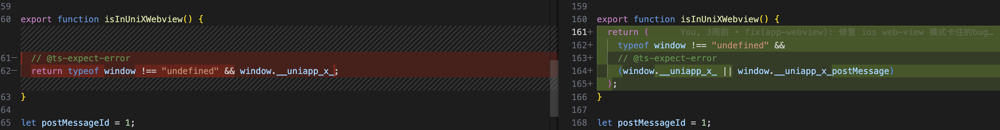
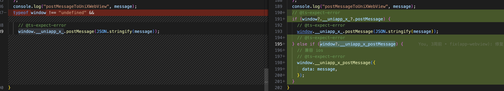
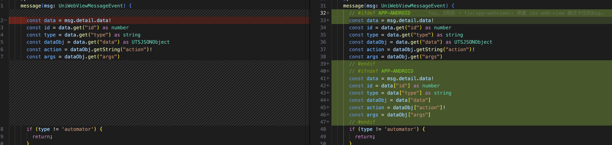

##### 问题1: iOS 修复 app-webview 模式 自动化测试无法连接的问题

问题：app-webview 模式运行卡住，且没有任何报错

分析过程：app-webview 模式是将基座中原有的app页面替换成一个带有webview组件的页面，webview 组件加载待测网页，待测网页 js 会通过 postMessage 向 webview 组件发送消息，然后 webview 组件监听 message 事件，如果 msg.detail.data === 'action' 则开始自动化测试方法。测试中发现，当自动化测试进程卡住不动时，在浏览器打开待测网页 url 并且手动执行自动化测试启动方法，自动化测试进行可以继续进行。由此可见，问题的原因出在了 message 事件没有触发。

进一步分析，测试 hello-uniappx 的 webview 组件的 message 事件可以触发，但是是通过加载一个外部 js 文件，通过调用uni.webView.postMessage 方法消息，而自动化测试框架是通过 window._uniapp_x_.postMessage，经过调试发现 iOS 上不存在 window.__uniapp_x_ 变量，找到了问题原因，通过搜索uniapp-next仓库搜索不到相关变量，推断此变量可能是 安卓 原生注入的变量，经过与其他同事确认得知确实是原生注入变量，iOS 可以用 window._uniapp_x_postMessage 方法

换了新的方法，经过调试发现 android 与 ios 的参数结果不一致，于是又改了一下





此时，自动化测试能过不再卡住，但是会报错，根据报错原因是 webview 组件页面的 message 方法使用的 uts 语法在ios不兼容，又对其做了兼容优化



最后能够正常运行了

##### 问题1: 小程序默认作用域插槽在使用自定义组件时必须指定v-slot="slotProps"才能显示（https://github.com/dcloudio/uni-app/issues/4822）

问题原因：所有作用域插槽都会被编译成具名插槽，但是默认作用域插槽的自定义组件会被编译成默认插槽（无slot="d"），然作用域插槽编译成具名插槽是为了解决插槽的遍历，不可改成默认插槽，只能将默认作用域插槽编译成具名插槽。


```js
// uni-mp-compiler/src/transforms/vSlot.ts
import {
  createDirectiveNode,
  createBindDirectiveNode,
  isUserComponent,
} from '@dcloudio/uni-cli-shared'
...
let onComponentSlot = findDir(node, 'slot', true)
...
if (
    !isTemplateNode(slotElement) ||
    !(slotDir = findDir(slotElement, 'slot', true))
  ) {
    // not a <template v-slot>, skip.
    if (slotElement.type !== NodeTypes.COMMENT) {
      implicitDefaultChildren.push(slotElement)
    }
  	// ++++
    if (!onComponentSlot) { // 此处需要判断是作用域插槽
      onComponentSlot = createDirectiveNode(
        'slot',
        SLOT_DEFAULT_NAME,
        'slotProps'
      )
    }
    // +++
    continue
  }
```

问题难点是如何在 VSlot 中判断 <slot></slot> 是否是作用域插槽（是否存在除name以外的属性），此处方法主要是解析 v-slot，而  <slot></slot> 在子组件，难以判断是否是作用域插槽

该问题暂存，等想到好的解决方案再解决

##### 问题2: 小程序分包引用分包内图片资源，路径会变成根目录/static/ (https://ask.dcloud.net.cn/question/167662)


已定为具体位置，难点是如何判断是否是分包，或者找到 options.base 源头位置看是否可以更好判断是否是分包

##### 问题3: 百度小程序 web-view 组件无法触发 message 事件（https://github.com/dcloudio/uni-app/issues/4681）

##### 问题4: 抖音小程序created前就加载了组件，导致组件数据可能不对（https://ask.dcloud.net.cn/question/189702?item_id=270366&rf=false）
