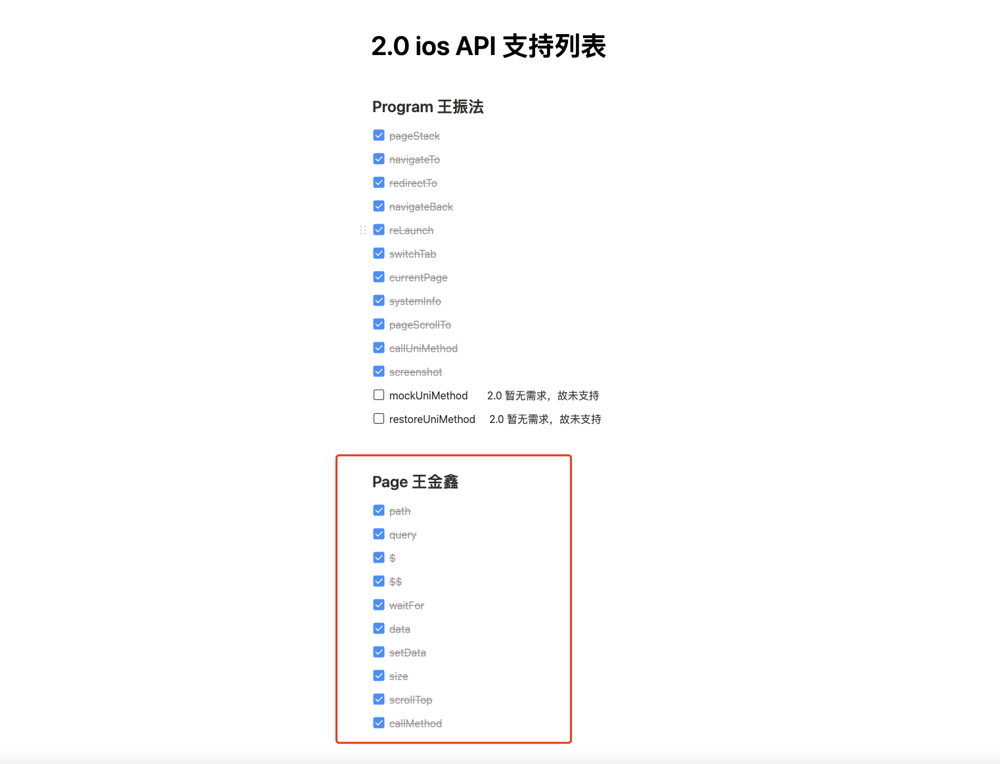
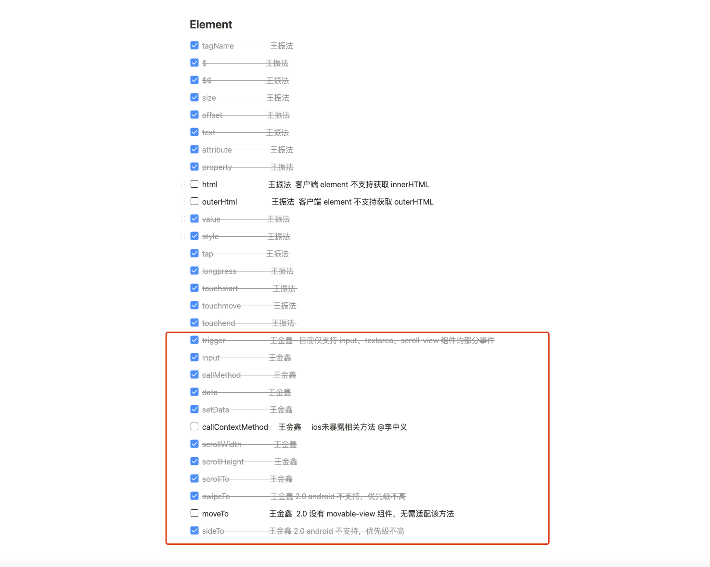

### 2、3月份工作内容

- 修复 2.0 iOS 自动化测试 element.offset 获取元素位置不对的问题（原因是之前获取的坐标是相对于视窗左上角为原点，已改成与与文档一致，页面左上角为原点）
- 修复 2.0 ios 自动化测试 element.callMethod 调用自定义组件实例指定方法失败的问题（原因是当一个页面存在多个自定义组件时，获取节点获取的不对）
- 排查 2.0 android app-webview模式的测试例超时原因（低版本安卓webview组件无法打开待测h5url，已反馈殷嘉呈排查，令发现有两个方法异常，有待排查）
- 处理自动化测试 2.0 android element.scrollTo 方法报错问题（原因是方法传参与文档不一致，已改为与文档一致）
- 修复自动化测试 1.0 vue3 (android、ios、h5) scroll-view 组件 scrollLeft、scrollTop、scrollWidth、scrollHeight 属性取值不对、scrollTo 方法不能正常工作的问题
- 支持 1.0 vue3 android element.input 方法（之前不支持是因为production环境el未挂载_vnode属性，改用__vueParentComponent） 
- 排查并修复 1.0 vue3 android7 模拟器 page.$ 获取元素失败的问题 （原因是uni-automator自动化测试打包时未处理Promise.finally方法不存在的兼容性问题）
- 自动化测试配置文件（对应 hx 项目中的 env.js），原 h5 属性同时兼容 web写法，原 app-plus 兼容 app写法
- 验证 webview-app 自动化测试模式在 2.0 ios 上是否可行 (验证可行，运行正常)
- 修复 windows x86-64 安卓模拟器，findstr 报错问题（原因是不支持findstr命令，已做兼容处理）
- 排查并修复 2.0 web端 devtools 报错问题（因 websocket 单个消息超出1MB，ws连接被断开，复杂的页面需要传递的数据超过1MB就会有问题，解决方法是将单个消息大小限制调整至100MB）

- 参与自动化测试 2.0 ios 端的兼容工作（红色圈中部分由我负责）

- 2.0 android 自动化测试支持 element.trigger 方法 (部分事件支持)
- 排查自动化测试依赖升级对hbx各端以及cli各端是否有影响

- 修复自动化测试 cli 环境 android 低版本模拟器缺少环境变量报错的Bug 
- 修复 jest 高版本可能会报错的问题（原因是jest@28 之后的版本某方法传参有变更，做了兼容处理）
- 支持 1.0 vue3 h5 element.input 方法
- 2.0 web  scrollLeft、scrollWidth 属性取值不对问题
- 日常回答社区以及github issues问题，排查问题，与用户沟通，给出解决方法
- 日常排查 test.dcloud.io 的测试例失败原因