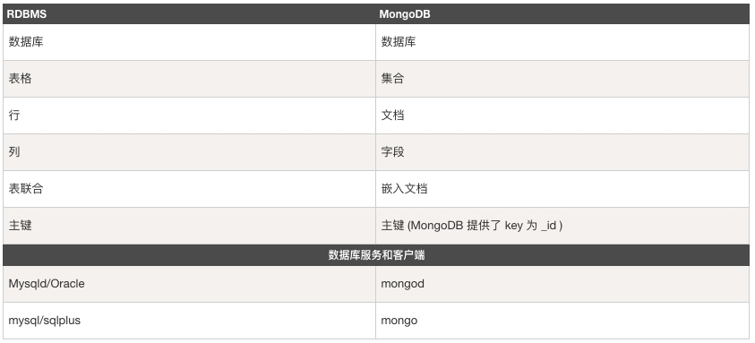
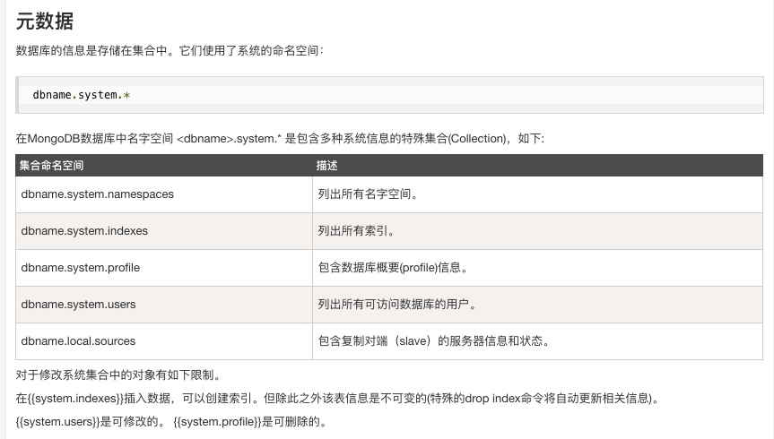
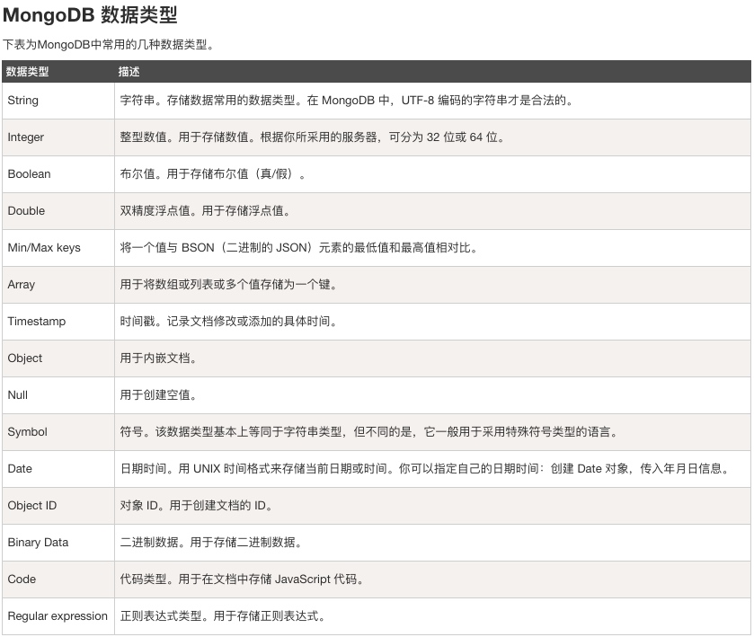
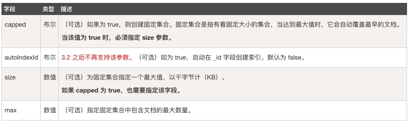

# 认识mongodb

MongoDB 是由C++语言编写的，是一个基于分布式文件存储的开源数据库系统。

在高负载的情况下，添加更多的节点，可以保证服务器性能。

MongoDB 旨在为WEB应用提供可扩展的高性能数据存储解决方案。

MongoDB 将数据存储为一个文档，数据结构由键值(key=>value)对组成。MongoDB 文档类似于 JSON 对象。字段值可以包含其他文档，数组及文档数组。

启动mongo服务 

```
mongod --dbpath /usr/local/var/mongodb --logpath /usr/local/var/log/mongodb/mongo.log --fork
```

### 主要特点
- MongoDB 是一个面向文档存储的数据库，操作起来比较简单和容易。
- 你可以在MongoDB记录中设置任何属性的索引 (如：FirstName="Sameer",Address="8 Gandhi Road")来实现更快的排序。
- 你可以通过本地或者网络创建数据镜像，这使得MongoDB有更强的扩展性。
- 如果负载的增加（需要更多的存储空间和更强的处理能力） ，它可以分布在计算机网络中的其他节点上这就是所谓的分片。
- Mongo支持丰富的查询表达式。查询指令使用JSON形式的标记，可轻易查询文档中内嵌的对象及数组。
- MongoDb 使用update()命令可以实现替换完成的文档（数据）或者一些指定的数据字段 。
- Mongodb中的Map/reduce主要是用来对数据进行批量处理和聚合操作。
- Map和Reduce。Map函数调用emit(key,value)遍历集合中所有的记录，将key与value传给Reduce函数进行处理。
- Map函数和Reduce函数是使用Javascript编写的，并可以通过db.runCommand或mapreduce命令来执行MapReduce操作。
- GridFS是MongoDB中的一个内置功能，可以用于存放大量小文件。
- MongoDB允许在服务端执行脚本，可以用Javascript编写某个函数，直接在服务端执行，也可以把函数的定义存储在服务端，下次直接调用即可。
- MongoDB支持各种编程语言:RUBY，PYTHON，JAVA，C++，PHP，C#等多种语言。
- MongoDB安装简单。

### 概念解析


### 数据库

一个mongodb中可以建立多个数据库。

MongoDB的默认数据库为"db"，该数据库存储在data目录中。

MongoDB的单个实例可以容纳多个独立的数据库，每一个都有自己的集合和权限，不同的数据库也放置在不同的文件中。

"show dbs" 命令可以显示所有数据的列表。

执行 "db" 命令可以显示当前数据库对象或集合。

**有一些数据库名是保留的，可以直接访问这些有特殊作用的数据库。**

- admin： 从权限的角度来看，这是"root"数据库。要是将一个用户添加到这个数据库，这个用户自动继承所有数据库的权限。一些特定的服务器端命令也只能从这个数据库运行，比如列出所有的数据库或者关闭服务器。
- local: 这个数据永远不会被复制，可以用来存储限于本地单台服务器的任意集合
- config: 当Mongo用于分片设置时，config数据库在内部使用，用于保存分片的相关信息。

### 文档(Document)

文档是一组键值(key-value)对(即 BSON)。**MongoDB 的文档不需要设置相同的字段**，并且相同的字段不需要相同的数据类型，这与关系型数据库有很大的区别，也是 MongoDB 非常突出的特点。

一个简单的文档例子如下：

{"site":"www.runoob.com", "name":"菜鸟教程"}


需要注意的是：

文档中的键/值对是有序的。
文档中的值不仅可以是在双引号里面的字符串，还可以是其他几种数据类型（甚至可以是整个嵌入的文档)。
MongoDB区分类型和大小写。
MongoDB的文档不能有重复的键。
文档的键是字符串。除了少数例外情况，键可以使用任意UTF-8字符。
文档键命名规范：

键不能含有\0 (空字符)。这个字符用来表示键的结尾。
.和$有特别的意义，只有在特定环境下才能使用。
以下划线"_"开头的键是保留的(不是严格要求的)。

### 集合
集合就是 MongoDB 文档组，类似于 RDBMS （关系数据库管理系统：Relational Database Management System)中的表格。

集合存在于数据库中，集合没有固定的结构，这意味着你在对集合可以插入不同格式和类型的数据，但通常情况下我们插入集合的数据都会有一定的关联性。

比如，我们可以将以下不同数据结构的文档插入到集合中：

{"site":"www.baidu.com"}
{"site":"www.google.com","name":"Google"}
{"site":"www.runoob.com","name":"菜鸟教程","num":5}

当第一个文档插入时，集合就会被创建。






### 常用命令

- 创建一个数据库或者切换到该数据库
use test

- 显示所有的数据库
show dbs

- 删除数据库
db.dropDatabase()

- 创建集合
db.createCollection(name, options)



- 显示所有的集合
show collections
或者
show tables

- 删除集合
db.user.drop()

- 添加一个文档
`db.user.insert({"name":"菜鸟教程"})`
或
`db.user.save({"name": "wangjinxin"})`

添加文档时如果这个集合没有创建，则会自动创建集合

save()：如果 _id 主键存在则更新数据，如果不存在就插入数据。该方法新版本中已废弃，可以使用 db.collection.insertOne() 或 db.collection.replaceOne() 来代替。
insert(): 若插入的数据主键已经存在，则会抛 org.springframework.dao.DuplicateKeyException 异常，提示主键重复，不保存当前数据

- 更新文档

```
db.collection.update(
   <query>,
   <update>,
   {
     upsert: <boolean>,
     multi: <boolean>,
     writeConcern: <document>
   }
)
```

参数说明：

query : update的查询条件，类似sql update查询内where后面的。
update : update的对象和一些更新的操作符（如$,$inc...）等，也可以理解为sql update查询内set后面的
upsert : 可选，这个参数的意思是，如果不存在update的记录，是否插入objNew,true为插入，默认是false，不插入。
multi : 可选，mongodb 默认是false,只更新找到的第一条记录，如果这个参数为true,就把按条件查出来多条记录全部更新。
writeConcern :可选，抛出异常的级别。

也可以使用save方法
save() 方法通过传入的文档来替换已有文档，_id 主键存在就更新，不存在就插入。语法格式如下：

```
db.collection.save(
   <document>,
   {
     writeConcern: <document>
   }
)
```
参数说明：

document : 文档数据。
writeConcern :可选，抛出异常的级别。

